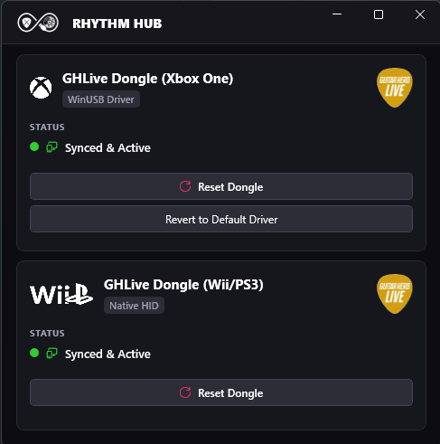

# RhythmHub


> **A modern, unified controller bridge and driver management app for rhythm game instruments on Windows.**



---

## The Problem It Solves

Historically, using rhythm game instruments on PC—such as Guitar Hero Live 6-fret guitars, Rock Band wireless controllers, and legacy console dongles—required running multiple fragmented, outdated CLI utilities simultaneously:
- **GHLPokeMachine** for sending periodic USB HID keep-alive "poke" signals to PS3/Wii U dongles.
- **RB4InstrumentMapper** for translating raw Xbox One controller packets.
- **Zadig** for manual driver swapping to WinUSB.
- **ViGEmBus** standalone tools for XInput emulation.

**RhythmHub** consolidates these tools into a single, high-performance, native Windows application with an automated USB hotplug manager, built-in driver swapper, and low-latency virtual XInput pipeline.

---

## Features

- 🎸 **Native WinUI 3 Interface**: Sleek, modern Fluent dark-theme GUI powered by the Windows App SDK.
- ⚡ **Auto-Detection & Hotplugging**: Real-time USB device discovery via WMI PnP and HidSharp event watchers.
- 🎮 **Unified Virtual XInput Pipeline**: Built-in ViGEmBus emulator (`VirtualPadEmulator`) for zero-allocation, low-latency input translation to Xbox 360 virtual gamepads.
- 🔄 **One-Click Driver Swapping**: Seamlessly switch Xbox One dongles between standard Windows PnP drivers and `WinUSB` directly inside the app without needing third-party tools like Zadig.
- 📡 **Native HID Poke Service**: Automatic background 10-second sync poke for PS3 and Wii U Guitar Hero Live dongles.
- 🎯 **Rhythm Game Ready**: Plug-and-play compatibility with **Clone Hero**, **YARG (Yet Another Rhythm Game)**, **Guitar Hero Live**, and **PCSX2/RPCS3** emulators.

---

## Supported Hardware

| Controller / Dongle | USB VID & PID | Driver / Mode | Status |
| :--- | :--- | :--- | :--- |
| **Xbox One GHLive Dongle** | `VID_1430 & PID_079B` | WinUSB + ViGEmBus XInput | ✅ Fully Supported |
| **PS3 / Wii U GHLive Dongle** | `VID_12BA & PID_074B` | Native HID + Auto-Poke | ✅ Fully Supported |

### 🔮 Future Hardware Roadmap
Additional dongle profiles will be added in future updates as physical hardware becomes available for testing:
- **PS4 Guitar Hero Live Dongles** (`VID_12BA & PID_074B` variant)
- **Xbox 360 Wireless Receiver** (`VID_045E & PID_0719`)
- **Rock Band 4 Xbox One Wireless Legacy Adapter**
- **Wii Wiimote Passthrough / Direct HID Adapters** (Raphnet, RetroCultMods)

*Have a controller dongle not listed here? Pull requests and hardware captures are welcome!*

---

## Installation & Prerequisites

### 1. Download & Install
Download the latest `RhythmHubSetup.exe` from the [Releases](https://github.com/username/RhythmHub/releases) page and run the installer. The wizard will set up RhythmHub in `C:\Program Files\RhythmHub` and create Start Menu and Desktop shortcuts.

### 2. Required Drivers

#### **Virtual Controller Driver (ViGEmBus)**
- **Required For**: Xbox One Guitar Hero Live dongles (maps GIP inputs to virtual Xbox 360 controller).
- **Not Required For**: Wii U or PS3 GHLive dongles (these operate natively as USB HID gamepads).
- **Installation**: The RhythmHub setup installer detects if ViGEmBus is installed and offers to install it automatically. You can also install it anytime from within the RhythmHub application dialog.

#### **WinUSB Driver (Xbox One Dongles Only)**
- Xbox One dongles require the `WinUSB` driver interface to communicate raw packets.
- RhythmHub includes a **built-in driver switcher**: select your connected Xbox One dongle in RhythmHub and click **"Switch to WinUSB"** (prompts UAC elevation). Alternatively, you can use [Zadig](https://zadig.akeo.ie/) to replace the driver with `WinUSB`.

---

## How to Use

1. **Launch RhythmHub**: Open RhythmHub from your Desktop or Start Menu.
2. **Connect Your Dongle**: Plug your Guitar Hero Live or rhythm game dongle into a USB port. RhythmHub will automatically detect the device and show connection status.
3. **Configure & Play**:
   - For **Wii / PS3 Dongles**: RhythmHub will automatically poke the dongle to keep it active.
   - For **Xbox One Dongles**: RhythmHub will translate frets, strumbar, whammy, and tilt into a virtual Xbox 360 controller.
4. **Launch Your Game**: Open **Clone Hero** or **YARG**—your guitar is ready to rock!

---

## Building from Source

### Prerequisites
- **Windows 10/11** (x64)
- **Visual Studio 2022** (17.3 or newer) with workloads:
  - `.NET Desktop Development`
  - `Windows App SDK / WinUI 3` component
- **.NET 6.0 SDK**
- **Inno Setup 6** (optional, for compiling the setup installer)

### 1. Clone the Repository
```powershell
git clone https://github.com/username/RhythmHub.git
cd RhythmHub
```

### 2. Build via .NET CLI
```powershell
dotnet build RhythmHub.csproj -c Release
```

### 3. Automated Publish & Packaging
Run our included PowerShell build script to perform a self-contained publish and compile `dist/installer/RhythmHubSetup.exe`:

```powershell
# Install Inno Setup compiler (if not already installed)
winget install --id JRSoftware.InnoSetup -e --accept-package-agreements --accept-source-agreements

# Run automated publish & packaging pipeline
.\build-and-publish.ps1
```

---

## Tech Stack & Architecture

- **Language & Runtime**: C# 10 / .NET 6.0 (Self-Contained `win-x64`)
- **UI Framework**: Unpackaged WinUI 3 (`Microsoft.WindowsAppSDK` 1.4)
- **USB & Device Management**:
  - `HidSharp` (Native HID enumeration & control endpoints)
  - `Nefarius.Drivers.WinUSB` & `Nefarius.Utilities.DeviceManagement` (PnP / WinUSB driver operations)
  - `WMI` (`Win32_PnPEntity`) for USB hotplug detection
- **Virtual Input**: `Nefarius.ViGEm.Client` (ViGEmBus Virtual Xbox 360 Controller)
- **MVVM Architecture**: `CommunityToolkit.Mvvm`

---

## Credits & Mentions

RhythmHub builds upon the foundation laid by the rhythm game reverse-engineering community:

- **[GHLPokeMachine](https://github.com/dtg0/GHLPokeMachine)** by **dtg0**: Pioneered the 10-second USB HID poke keep-alive protocol for PS3/Wii U GHLive dongles.
- **[RB4InstrumentMapper](https://github.com/parter/RB4InstrumentMapper)** by **parter**: PnP driver and packet mapping research for Xbox One rhythm game controllers.
- **[ViGEmBus](https://github.com/nefarius/ViGEmBus)** by **Nefarius (Benjamin Høglinger-Stelzer)**: The premier Windows kernel driver for virtual gamepad emulation. If ViGEmBus receives future updates or migrations (such as [VirtualPad](https://github.com/nefarius/VirtualPad)), RhythmHub will track these official Nefarius driver releases.
- **[Clone Hero](https://clonehero.net/)** & **[YARG](https://yarg.in/)**: For keeping the rhythm game community thriving.

---

## License & Contributing

This project is licensed under the **MIT License**. See the [LICENSE](LICENSE) file for details.

Contributions are welcome! If you have hardware to test or want to add support for new dongles and instruments, feel free to submit an issue or pull request.
